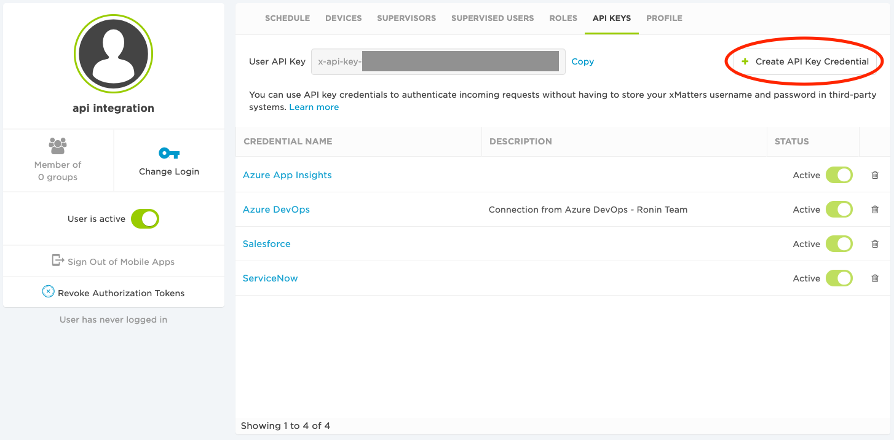
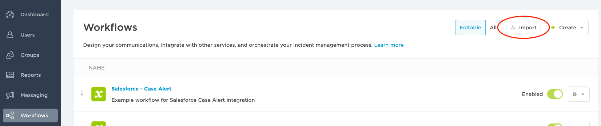
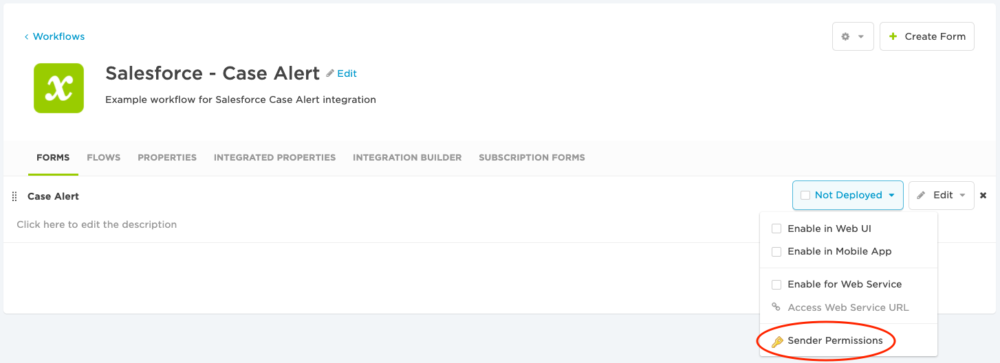
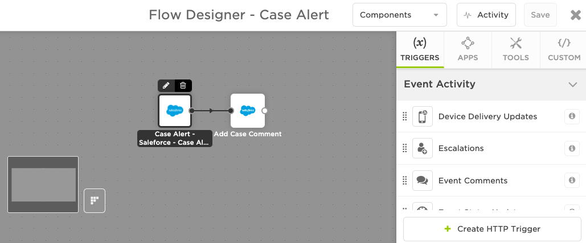
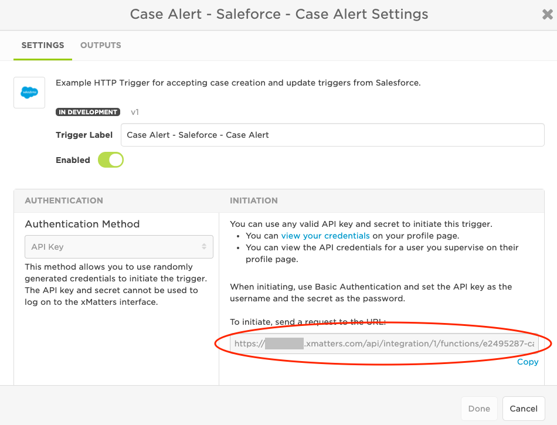
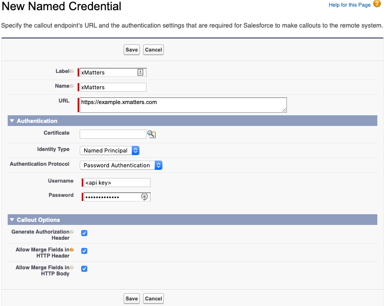
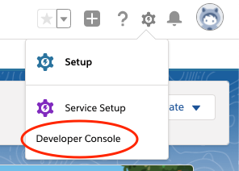

# Salesforce - Case Alert
This is a one-way integration with Salesforce that will trigger an xMatters flow when a case is created or updated. It can be used along with the builtin xMatters Salesforce steps to create a closed-loop integration.

Salesforce will send the xMatters flow the case information along with getting details for the associated Salesforce account, case creator, case owner, and case modifier.  It can also be modified to process Salesforce sObject custom fields.

This integration can also be used as an example to building other integrations from triggers on other actions or sObjects in Salesforce.

[](https://support.xmatters.com/hc/en-us/community/topics)

---
## Pre-Requisites
* Salesforce
    * Permission to create/deploy **Apex Classes** and **Apex Triggers**
    * Permission to create **Named Credentials**
* xMatters
    * Account - if you don't have one [get one](https://www.xmatters.com) for free
    * Permissions to create/edit Workflows

---
## Files
* Salesforce
    * [xMattersReq.apxc](Salesforce/src/apexClasses/xMattersReq.apxc) - Apex class for sending HTTP request to xMatters
    * [xMattersReqTest.apxc](Salesforce/src/apexClasses/xMattersReqTest.apxc) - basic Apex test class for code coverage
    * [xMattersHttpCalloutMock.apxc](Salesforce/src/apexClasses/xMattersHttpCalloutMock.apxc) - basic test class for code coverage
    * [xMattersCaseAlert.apxt](Salesforce/src/apexTriggers/xMattersCaseAlert.apxt) - Apex trigger on case insert and update
* xMatters
    * [SalesforceCaseAlert.js](xMatters/src/xmTriggers/SalesforceCaseAlert.js) - xMatters HTTP Trigger source code
    * [SalesforceCaseAlert.zip](xMatters/workflows/SalesforceCaseAlert.zip) - example workflow

---
## How It Works
When a Salesforce case is either created or modified it will invoke the Apex Trigger which will gather the case, account, creator, owner, and modifier information.  It will then send that to the xMattersReq class to send the payload to the configured xMatters HTTP Trigger endpoint.  The xMatters HTTP Trigger will process the payload to outputs to be utilized by other flow steps.

<kbd>
    
</kbd>

The example workflow only adds a comment back to the case, but that is just to show that it worked and that your xMatters flow can also connect back to Salesforce. You can add whatever steps you like after the initial trigger like sending an xMatters notification, posting to a Slack channel, MS Teams channel, or based on case information create a related Jira issue.  Or whatever you need it to do.

## :red_circle: WARNING 
If you are going to use an xMatters step that updates a Salesforce case in this xMatters flow then you must modify the Apex Trigger configuration or logic. It will create an infinite loop if you do not. Luckily if you leave xMatters settings as default it should detect a flood, but it can still take a few seconds. <span style="color:green">Adding a case comment is not considered a case update.</span>  There is another warning in the Installation steps with instructions on how to update the trigger. If you forget the fastest action is to disable the workflow until you fix it.

---
## Installation
### xMatters Setup
1.  If you do not already have an xMatters user specifically for integrations it is recommended to create one.  This account should only be used for integrations. You can create the API key under any user account.
2. Under this integration user create a new API key to use with Salesforce. *Make sure to note the key and secret for later when we configure Saleforce.* [Instructions](https://help.xmatters.com/ondemand/user/apikeys.htm)

    <kbd>
        
    </kbd>

3. Import the example workflow. [Instructions](https://help.xmatters.com/ondemand/xmodwelcome/workflows/manage-workflows.htm)

    <kbd>
        
    </kbd>

4.  Modify the **Case Alert** form in the imported workflow and give the integration user sender permissions on the form. [Instructions](https://help.xmatters.com/ondemand/xmodwelcome/communicationplanbuilder/formpermissions.htm)

    <kbd>
        
    </kbd>

5. Now open the corresponding flow **Case Alert** and you will see one trigger on the canvas called **Salesforce - Case Alert**
6. Hover over the trigger step and select edit.

    <kbd>
        
    </kbd>

7. On the Settings tab copy the trigger's URL and paste it in your notes for later.

    <kbd>
        
    </kbd>

If you are using the imported example workflow you will also need to configure the endpoint used by the built-in Add Comment step for your Salesforce instance.

1. Configure the Salesforce endpoint. Once completed this endpoint can be used with the other built-in Salesforce steps. [Instructions](https://help.xmatters.com/ondemand/xmodwelcome/flowdesigner/components.htm#OAuthSalesforce)
2. Configure the Add Comment step for the new endpoint. [Instructions](https://help.xmatters.com/ondemand/xmodwelcome/flowdesigner/salesforce-servicecloud-steps.htm?cshid=FlowSalesforce)

### Salesforce Setup
This is not intended to be a comprehensive guide on setting up and deploying Salesforce Apex Triggers/Classes. These instructions are to give the basic steps of what will need to be setup on the Salesforce side for this integration to work. Please refer to Salesforce guides and your companies best practices for modifying a Saleforce instance.

1. Go to **Setup -> Security -> Named Credentials** and create a new Named Credential
    * **Label** = xMatters
    * **Name** = xMatters *(If you set differently then it must be updated in the Apex Trigger later)*
    * **URL** = *(Your xMatters instance base URL: https://example.xmatters.com)*
    * **Idientity Type** = Named Principle
    * **Authentication Protocol** = Password Authentication
    * **Username** = *(API key you saved from xMatters configuration)*
    * **Password** = *(API secret you saved from xMatters configuration)*
    * **Generate Authorization Header** = enabled
    * **Allow Merge Fields in HTTP Header** = enabled
    * **Allow Merge Fields in HTTP Body** = enabled

    <kbd>
        
    </kbd>

2. Open the Salesforce Developer Console to create the following resources

    <kbd>
        
    </kbd>

3. Create a new Apex Trigger (xMattersCaseAlert)
    * **Name** = xMattersCaseAlert
    * **sObject** = Case
    * Paste in the code from [xMattersCaseAlert.apxt](Salesforce/src/apexTriggers/xMattersCaseAlert.apxt)
    * Under the TRIGGER CONFIGURATION section modify the following
        * **sfNamedCreds** =  *(If you used a different name for the Named Credential change this)*
        * **xmTriggerPath** = *(Enter the path portion of the xMatters HTTP Trigger step you copied earlier noting the example)*
        * **sfUserFields** = *(If you want add more User sObject fields to the list you want included)*
        ```java
        /**
        * TRIGGER CONFIGURATION
        *
        * Must at the very least configure the Named Credentials and xMatters HTTP Trigger URL.
        */

        //[SET TO YOUR NAMED CREDENTIALS] 
        //Salesforce Named Credentials for xMatters instance
        String sfNamedCreds = 'xMatters';

        //[CHANGE TO YOUR XMATTERS TRIGGER] 
        //The xMatters HTTP Trigger path excluding the protocol,domain,and first slash
        String xmTriggerPath = 'api/integration/1/functions/a1b2c3d4-a1b2-a1b2-a1b2-a1b2c3d4e5f6/triggers';
        
        //Comma separated list of the Salesforce User fields to include when getting 
        //related case users (owner, creator, modifier) information. Can be custom fields, but
        //must be valid User sObject fields.
        String sfUserFields = 'id, username, lastname, firstname, name, companyname, email, alias, communitynickname, isactive';
        ```
    * <div class="text-white bg-red mb-2"><strong>WARNING:</strong></div> If you are going to use an xMatters step that updates a Salesforce case in this xMatters flow then you must remove the "after update" action from the Apex Trigger or update the Apex Trigger logic. It will create an infinite loop if you do not. Luckily if you leave xMatters settings as default it should detect a flood, but it can still take a few seconds. <span style="color:green">Adding a case comment is not considered a case update.</span> If you forget the fastest action is to disable the xMatters workflow until you fix it. You can remove the update action and only trigger on case creation by changing this
        ```java
        trigger xMattersCaseAlert on Case (after insert, after update) {
        ```
        to this
        ```java
        trigger xMattersCaseAlert on Case (after insert) {
        ```
4. Create a new Apex Class (xMattersReq)
    * **Name** = xMattersReq
    * Paste in the code from [xMattersReq.apxc](Salesforce/src/apexClasses/xMattersReq.apxc)
5. Create a new Apex Class (xMattersReqTest)
    * **Name** = xMattersReqTest
    * Paste in the code from [xMattersReqTest.apxc](Salesforce/src/apexClasses/xMattersReqTest.apxc)
6. Create a new Apex Class (xMattersHttpCalloutMack)
    * **Name** = xMattersHttpCalloutMock
    * Paste in the code from [xMattersHttpCalloutMock.apxc](Salesforce/src/apexClasses/xMattersHttpCalloutMock.apxc)
7. This should work on Sandbox/Developer instances. To move to production Salesforce systems you will need to follow Salesforce deployment guidelines.

---
## Testing
1. Create or modify a case in Salesforce
2. In xMatters the new HTTP Trigger should be fired and any following steps executed.
    * If using the imported workflow and the comment step is configured the case should have a comment added.
3. You can view the Activity panel in Flow Designer and verify the expected body payload was received.  It should look similar to this unless you modified it. [Instructions](https://help.xmatters.com/ondemand/xmodwelcome/flowdesigner/activity-panel.htm)
    ```json
    {
        "reason": "case updated",
        "case": {
            "attributes": {
            "type": "Case",
            "url": "/services/data/v48.0/sobjects/Case/5004R00001YUzRZQA1"
            },
            "Origin": "Web",
            "Status": "New",
            "LastModifiedDate": "2020-04-28T14:28:06.000+0000",
            "IsDeleted": false,
            "AccountId": "0014R00002ekd59QAA",
            "Description": "Test 2",
            "Priority": "Medium",
            "CreatedByAlias": "EMaxw",
            "IsClosed": false,
            "Reason": "Performance",
            "Subject": "Test 2",
            "SystemModstamp": "2020-04-28T14:28:06.000+0000",
            "BusinessHoursId": "01m4R000000DEQvQAO",
            "Type": "Other",
            "CreatedById": "0054R00000APhZqQAL",
            "IsEscalated": false,
            "OwnerId": "0054R00000APhZqQAL",
            "ClosedOnCreate": false,
            "CreatedDate": "2020-04-09T20:35:47.000+0000",
            "IsClosedOnCreate": false,
            "CaseNumber": "00001027",
            "Id": "5004R00001YUzRZQA1",
            "LastModifiedByAlias": "EMaxw",
            "LastModifiedById": "0054R00000APhZqQAL"
        },
        "account": {
            "attributes": {
            "type": "Account",
            "url": "/services/data/v48.0/sobjects/Account/0014R00002ekd59QAA"
            },
            "Name": "Test Account",
            "Id": "0014R00002ekd59QAA"
        },
        "owner": {
            "attributes": {
            "type": "User",
            "url": "/services/data/v48.0/sobjects/User/0054R00000APhZqQAL"
            },
            "Id": "0054R00000APhZqQAL",
            "Username": "example@gmail.com",
            "LastName": "Doe",
            "FirstName": "John",
            "Name": "John Doe",
            "CompanyName": "xMatters",
            "Email": "example@gmail.com",
            "Alias": "EMaxw",
            "CommunityNickname": "example",
            "IsActive": true
        },
        "creator": {
            "attributes": {
            "type": "User",
            "url": "/services/data/v48.0/sobjects/User/0054R00000APhZqQAL"
            },
            "Id": "0054R00000APhZqQAL",
            "Username": "example@gmail.com",
            "LastName": "Doe",
            "FirstName": "John",
            "Name": "John Doe",
            "CompanyName": "xMatters",
            "Email": "example@gmail.com",
            "Alias": "EMaxw",
            "CommunityNickname": "example",
            "IsActive": true
        },
        "modifier": {
            "attributes": {
            "type": "User",
            "url": "/services/data/v48.0/sobjects/User/0054R00000APhZqQAL"
            },
            "Id": "0054R00000APhZqQAL",
            "Username": "example@gmail.com",
            "LastName": "Doe",
            "FirstName": "John",
            "Name": "John Doe",
            "CompanyName": "xMatters",
            "Email": "example@gmail.com",
            "Alias": "EMaxw",
            "CommunityNickname": "example",
            "IsActive": true
        }
    }
    ```

---
## Troubleshooting
### xMatters Not Recieving Trigger
* Verify the xMatters workflow is enabled
* Does the xMatters user that owns the API key have send permissions on the flow form?
* Open the Salesforce Developer Console and view the logs and verify there are no errors
* Are the Salesforce Named Credentials configured correctly?
    * Correct xMatters instance
    * Correct API key and secret
* Is the Apex Trigger configured for the correct xMatters HTTP Trigger?
    * Correct Salesforce Named Credentials
    * Correct xMatters HTTP Trigger path and format matches example


### xMatters HTTP Trigger Throwing Error
* If you modified the Apex Trigger verify it is sending the expected payload format
    * Make sure to modify the xMatters HTTP Trigger as needed